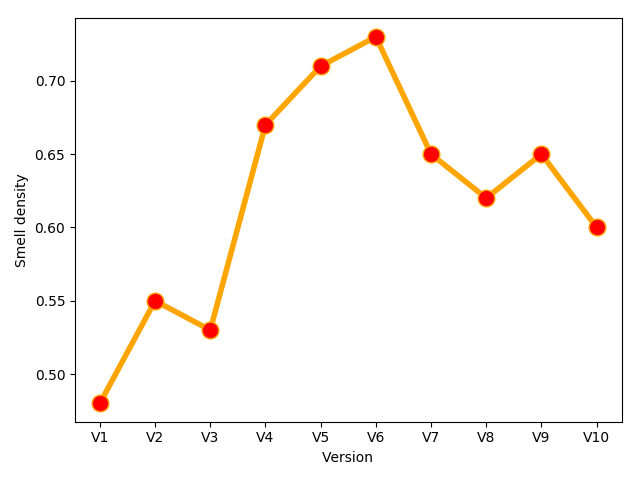
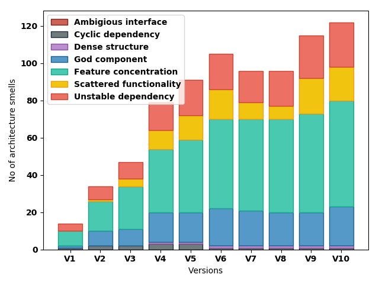
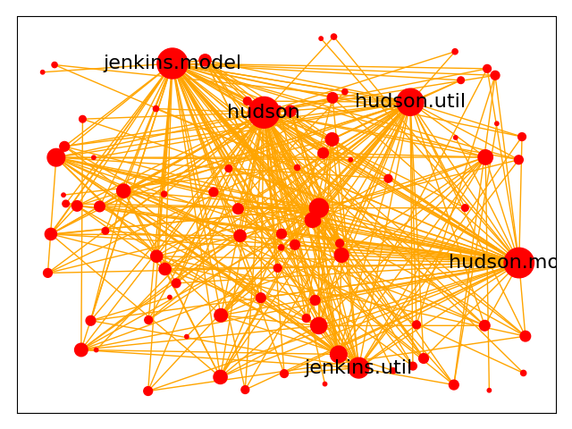

# Architecture Quality Evolution
A utility program to analyze architecture quality evolution for Java programs. It uses [DesigniteJava Enterprise](http://www.designite-tools.com/designitejava) to analyze multiple versions of a Java project and detect architecture smells. This utility then produces evolution data (LOC and number of architecture smells in each version) and plots (architecture smell density, version-wise architecture smell distribution, and component dependency structure).

## How to run
### Prerequisite and assumptions
1. It assumes you have DesigniteJava Enterprise edition on your machine with Java 8+ installed. You may download DesigniteJava Enterprise from [Designite website](http://www.designite-tools.com/designitejava).
1. It assumes that your code is in a git repository. It copies the source code folder specified by you to a temporary location, checkout different versions of the repository and analyzes them.
1. It attempts to build your code using maven using ```mvn clean install -DskipTests```. If you are not using maven or your build requires much more complex setup, you may change the implementation of ```analyze_project._build_project``` method. The tool requires classpath folders to analyze and resolve symbols correctly. The tool finds all the classpath folders if they are present in the provided source code folder.
1. The utility is dependent on following modules:
    - matplotlib
    - networkx
    - numpy
    - PyDriller

### How to run
Specify the following parameters in ```main.py```
- Full path of DesigniteJava
- Full path of source code folder
- Full path of temporary folder
- Full path of output folder (don't keep any other files/folders in this folder; this utility will delete all of them before generating result of the analysis)
- Number of versions to analyze

Then, run the python file using python3

```
python3 main.py
```

## Sample output and screenshots
This utility produces following csv files.
- Smell analysis summary
- Smell distribution across analyzed versions

It also generates and stores following plots.
- Architecture smell density vs versions
- Architecture smell distribution vs versions
- Component dependency structure. It is generated for all analyzed versions but only when DesigniteJava detects a dense structure architecture smell in that version.

When analyzed Jenkins, the utility produced the output presented below.

**Smell analysis summary**

|Version|Commit-hash                             |Date      |LOC   |Total architecture smells|
|-------|----------------------------------------|----------|------|-------------------------|
|V1     |8a0dc230f44e84e5a7f7920cf9a31f09a54999ac|2006-11-05|29345 |14                       |
|V2     |c817a9dae8fbc406ee4d62ddfc10d57424ee8a2e|2008-03-03|61742 |34                       |
|V3     |f4302f544d0fb0165cdd10da073d06678e66ebe3|2009-04-03|89374 |47                       |
|V4     |7c3e2b1cf449c84865df159365f1a5224eab25e8|2010-12-22|118664|79                       |
|V5     |753d6253485b0bd0b328b89bc39927fc44b37611|2011-12-25|127511|91                       |
|V6     |5894e301abcb1fe434cee9b7385af3ace11d1cb6|2013-05-22|144107|105                      |
|V7     |149d078adb3a08755978095f895d692305150ba3|2014-08-10|147747|96                       |
|V8     |57473e82ce63db47bbaf53383629aa2bd14def26|2016-02-03|155904|96                       |
|V9     |adf01d08884bcebbb802543fb71c68073bb6c7cc|2017-07-22|178189|115                      |
|V10    |374ce3a0d8a65d8e5e74111f5da9488e9a46c2ca|2019-08-16|203144|122                      |


**Smell distribution across analyzed versions**

|Version|Ambigious interface                     |Cyclic dependency|Dense structure|God component|Feature concentration|Scattered functionality|Unstable dependency|
|-------|----------------------------------------|-----------------|---------------|-------------|---------------------|-----------------------|-------------------|
|8a0dc230f44e84e5a7f7920cf9a31f09a54999ac|0                                       |1                |0              |1            |8                    |0                      |4                  |
|c817a9dae8fbc406ee4d62ddfc10d57424ee8a2e|0                                       |2                |0              |8            |16                   |1                      |7                  |
|f4302f544d0fb0165cdd10da073d06678e66ebe3|0                                       |2                |0              |9            |23                   |4                      |9                  |
|7c3e2b1cf449c84865df159365f1a5224eab25e8|0                                       |3                |1              |16           |34                   |10                     |15                 |
|753d6253485b0bd0b328b89bc39927fc44b37611|0                                       |3                |1              |16           |39                   |13                     |19                 |
|5894e301abcb1fe434cee9b7385af3ace11d1cb6|0                                       |1                |1              |20           |48                   |16                     |19                 |
|149d078adb3a08755978095f895d692305150ba3|0                                       |1                |1              |19           |49                   |9                      |17                 |
|57473e82ce63db47bbaf53383629aa2bd14def26|0                                       |1                |1              |18           |50                   |7                      |19                 |
|adf01d08884bcebbb802543fb71c68073bb6c7cc|0                                       |1                |1              |18           |53                   |19                     |23                 |
|374ce3a0d8a65d8e5e74111f5da9488e9a46c2ca|0                                       |1                |1              |21           |57                   |18                     |24                 |


**Architecture smell density vs versions**



**Architecture smell distribution vs versions**



**Component dependency structure**



It shows names of 5 packages with highest degree (dependency to other packages).